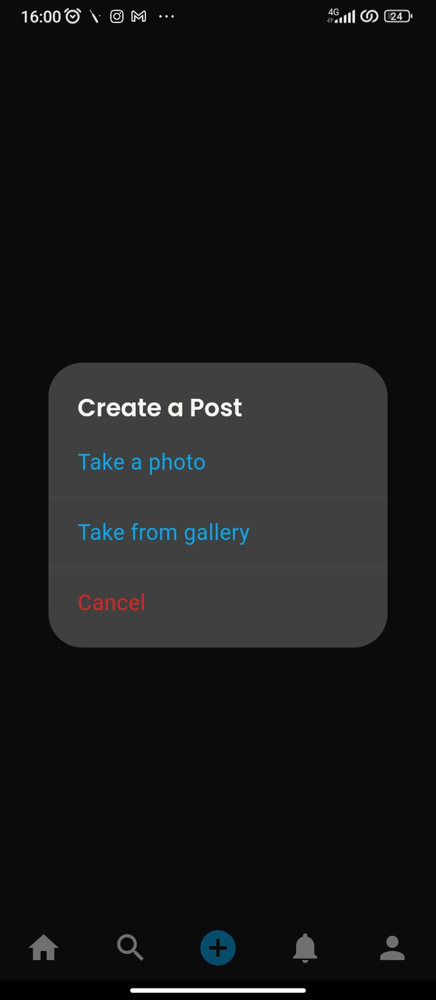

# 📱 Posting Social Media App (Flutter)

## Overview
The Posting Social Media App is built using Flutter and Firebase, allowing users to share microblogs, videos, and more. It includes features such as notifications for followers, profile management, and real-time content updates.

## Features
- User authentication (Firebase)
- Post microblogs and videos
- Follow other users
- comment for new posts
- Real-time updates

## Installation

### Prerequisites
- Flutter SDK (>=2.0.0)
- Dart (>=2.12.0)
- Firebase account
- Android Studio or VS Code

### Setup Steps
1. **Clone the Repository**
   ```bash
   git clone https://github.com/uchamod/Posting-social-media-app-flutter.git
   cd Posting-social-media-app-flutter
   ```

2. **Install Dependencies**
   ```bash
   flutter pub get
   ```

3. **Firebase Configuration**
   - Add `google-services.json` to `/android/app/`
   - Add `GoogleService-Info.plist` to `/ios/Runner/`
   - Enable Authentication and Firestore in Firebase Console

4. **Run the Application**
   ```bash
   flutter run
   ```

## Acknowledgment
Special thanks to:
- Flutter team for the amazing framework
- Firebase for backend services
- All contributors who helped improve this project
- Open source packages used in this project:
  - provider
  - firebase_core
  - cloud_firestore
  - firebase_auth
  - And other supporting packages

## Contact
- 👨‍💻 Developer: Chamod Udara
- 📧 Email: uchamod@gmail.com
- 🌐 GitHub: https://github.com/uchamod
- 💼 LinkedIn: https://www.linkedin.com/in/chamod-udara-b3927a239/

---

### 📱 Screenshots





### 🤝 Contributing
Contributions are always welcome! Please read the contribution guidelines first.

### 📄 License
This project is licensed under the MIT License - see the [LICENSE](LICENSE) file for details.
